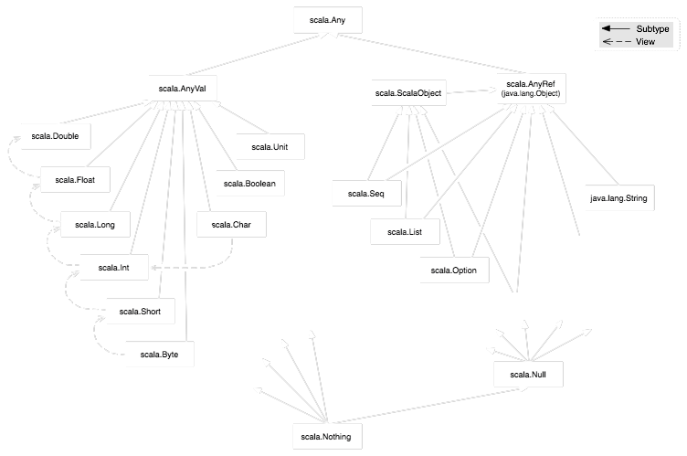
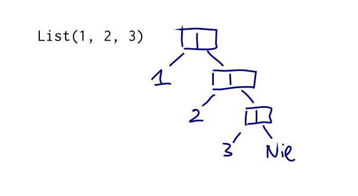

autoscale: true


#[fit] A Scala Primer For Spark

---

# Agenda
- Why Scala?
- Getting Started
- Literals, Values, Variables, and Types
- Expressions / Control Structures
- First Class Functions
- Collections
- Object-Oriented Scala

---

# Why Scala?


---

Martin Odersky and team at EPFL created Scala in 2004 to provide a high-performance, concurrent-ready, statically typed JVM language which supports both functional and object-oriented programming

-
> When Matei Zaharia set out to create Spark, he wanted a programming language that provided LINQ style interface  (where people write functions inline, etc). He also wanted it to be on the JVM in order to easily interact with the Hadoop file system and related data formats. The presence of this kind of functional syntax along with static typing, type inference, pattern matching, actor libraries etc resulted in Scala being the choice

^ Eric Raymond 

^ cathedral  -> a near-perfect building that takes a long time to build. Once built, it stays unchanged for a long time.

^ bazaar -> is adapted and extended each day by the people working in it. 

^ Scala  more like a bazaar than a cathedral

^ It is designed to be extended and adapted by the people programming in it - it puts the tools for building such constructs into your hands.

---

Compatibility
> Scala code can reuse existing Java libraries - as it allows us to call Java methods, access Java fields, inherit from Java classes, and implement Java interfaces

Conciseness 
> Scala’s syntax avoids some of the boilerplate that burdens Java programs

Statically typed
> Scala  has an advanced static type system. It allows us to parameterize types with generics, combine types using intersections (e.g., A with B with C), and hide details of types using abstract types. Type inference and Pattern matching addresses the general concerns with statically typed languages - verbosity and lack of flexibility

---

## [fit]Scala for Spark

- Spark supports Scala, Java, Python, R, and SQL

- Data Engineers often prefer Scala & Java for building resilient infra for Big Data

- Data Scientists often use Python, R, and SQL

- These aren't hard boundaries and often people play both roles

---

# Goals
---

Levels of expertise for Scala[^1]

Application Programmer | Library Designer | Overall Level
---|---|---
Beginning  A1 |  | Beginning
Intermediate A2 | Junion L1 | Intermediate
Expert A3 | Senior L2 | Advanced
 | Expert L3 | Expert


[^1]: http://www.scala-lang.org/old/node/8610 

---

 __A1  (Beginning application programmer)__
	- Statements and expressions
	- Class, object, def, val, var, import, package
	- Infix notation for method calls
	- Simple closures & For-expressions
	- Collections with map, filter, etc

__L1  (Junior library designer)__
	- Type parameters, Traits, Lazy vals
	- Control abstraction, Currying
	- By-name parameters

__A2  (Intermediate application programmer)__
	- Pattern matching,  Trait composition
	- Recursion (tail recursion)
	- ~~XML literals~~

---

__L2 (Senior library designer)__
- Variance annotations, Existential types 
- Self type annotations and the cake pattern
- Structural types (static duck typing)
- Defining map/flatmap/withFilter for new kinds of for-expressions
- Extractors

__A3  (Expert application programmer)__
- Folds
- Streams and other lazy data structures
- Actors
- Combinator parsers

### We'll cover A1, L1, A2 and some sections in A3 and L2

---

#Scala's Road Ahead 


Dotty - http://dotty.epfl.ch/

- New Scala compiler
- Aiming to simplify Scala’s types and syntax, based on DOT (https://infoscience.epfl.ch/record/215280)
- Half the size of current compiler
- Twice faster
- Drops / adds features


---

# Getting Started

---

## [fit]Scala is object-oriented

Scala is an object-oriented language in pure form 

- every value is an object and 
- every operation is a method call

```scala
//invoking a method named + defined in class Int
1 + 2
```   

---
## [fit]Scala is object-oriented

Objects are constructed by mixin composition, which takes the members of a class and adds the members of a number of traits to them

```scala
 class Iter extends StringIterator(args(0)) with RichIterator
 ```

^ Java supports primitive types which are not objects and also allow static fields and methods that are not members of any objects

^ Traits and mixin composition would be covered in detail in subsequent slides

---
## [fit]Scala is functional

Scala treats functions are first-class values. It allows us to  

- pass functions as arguments to other functions
- return them as results from functions
- store them in variables
- define a function inside another function
- define functions without giving them a name

---

## [fit]Scala is functional

```scala
	val xs = 1 to 3
	val it = xs.iterator
	eventually { it.next() shouldBe 3 }	
```

Scala encourages immutable data structures and referentially transparent methods (not having any side effects)

---

# [fit] Scala's Roots

- Scala adopts a large part of the syntax of Java and C#. Expressions, statements, and blocks are mostly as in Java, as is the syntax of classes, packages and imports

- Its uniform object model (every value is an object and every operation is a method call) was pioneered by Smalltalk and taken up subsequently by Ruby

- Its uniform access principle ( that there should be no syntactical difference between working with an attribute, precomputed property, or method/query of an object)  comes from Eiffel

- Its approach to functional programming is quite similar in spirit to the ML family of languages, which has SML, OCaml, and F#

- Scala standard library is influenced by Haskell. Scala’s main concurrency library - Akka, was heavily inspired by Erlang

---

# [fit]Setting up the Environment 

http://sdkman.io/

```bash


curl -s "https://get.sdkman.io" | bash

sdk list scala

sdk i scala 2.11.8
sdk i sbt

scalac -version
```

---

# [fit]Setting up the Environment 

> Configure 
http://scalameta.org/scalafmt/ 
http://www.scalastyle.org/

The lack of  binary compatibility in Scala [^binary-compatibility]


[^binary-compatibility]: http://docs.scala-lang.org/overviews/core/binary-compatibility-of-scala-releases.html , http://www.scala-lang.org/old/node/9346

---

## [fit]First Steps

```scala
scala> 1 + 2
res0: Int = 3

scala> println("hola")
hola

```

*res0* - an identifier (automatically generated in this case)
*Int* -  scala.Int the type (class Int in the package scala)
*3* - the value resulting from evaluating the expression 


 - Every expression in Scala has a type and a value. 
 - Type is determined at compile time and the 
 - Value is determined by executing the expression


^ All of Java’s primitive types have corresponding classes in the scala package
Scala compiler would use Java primitive types where possible

---

## Pop Quiz


Reason for keeping primitives in Java  [^whyprim] 


[^whyprim]: http://www.javaworld.com/article/2150208/java-language/a-case-for-keeping-primitives-in-java.html

[^whynotprim]: http://wiki.c2.com/?JavaPrimitiveTypesDiscussion

---

##Vals & Vars

```scala 
//vals can never be reassigned once initialized
//similar to a final variable in Java 
scala> val msg = "hello"
msg: String = hello

//vars can be reassigned throughout its lifetime
scala> var i = 10
i: Int = 10

```

- vals are preferred over vars
- immutability increases stability and predictability (esp concurrent or multithreaded code)
- makes debugging and reading easier


^ data stored in vals and vars get automatically deallocated by JVM during GC

---

## Type Inference


```scala 
scala> val msgGreet: String = "hello again"

```

>Often better to let the interpreter/compiler infer types than fill the code with explicit type annotations

```scala 
//Scala inferred the type of msg to be String
scala> val msg = "hello"
msg: String = hello

```

---

# Types

In Scala, 

- all values have a type, including numerical values and functions
- all values are objects (instances of a class)

---

# class hierarchy



---

# Types

- Any is the supertype of all types (defines  universal methods such as equals, hashCode, and toString)
- AnyVal represents value types Double, Float, Long, Int, Short, Byte, Char, Unit, and Boolean  (non-nullable)
- AnyRef represents reference types
- Every user-defined type in Scala is a subtype of AnyRef (corresponds to java.lang.Object in JRE)


---
# Types

```scala

val list: List[Any] = List(
  "a string",
  732,  // an integer
  'c',  // a character
  true, // a boolean value
  () => "an anonymous function returning a string"
)
list.foreach(element => println(element))

```

---

# Nothing and Null


**Nothing** 

- is a Trait and a subtype of everything. 
- there are no instances of Nothing. 
- used to signal non-termination such as a thrown exception, program exit, or an infinite loop etc

**Null** 

- is a Trait and a subtype of all reference types. 
- there exists exactly one instance of Null, and that is _null_ .
- provided mostly for interoperability with other JVM languages and should almost never be used in Scala code
- often abused to represent an absent optional value; scala provides better alternatives

---

# Option/Some/None

- Option[A] is a container for an optional value of type A
- If the value of type A is present, the Option[A] is an instance of Some[A]
- If the value is absent, the Option[A] is the object None

>idiomatic way of initializing, setting, and accessing a variable

```scala

// 1) initialize with Option and None
var firstName = None: Option[String]

// 2) set the value with Some
firstName = Some("Al")

// 3) access the value, typically with getOrElse
println(firstName)
println(firstName.getOrElse("No name given"))
```

----
# Strings


> Built on Java’s String and adds  features like multiline literals and string interpolation

- == checks for true equality, not object reference equality
- multiline String can be created using triple-quotes """
- dollar sign operators ($) (with optional braces) can be used to note references to external data

```scala
val str = "mundo"
println(s" hola $str")
```

---
# Tuples

A tuple is an ordered container of two or more values, all of which may have different types.

- useful when you need to logically group values, representing them as a coherent unit
- unlike lists and arrays, however, there is no way to iterate through elements in a tuple

```scala

scala> val info = (10, "hello", true)
info: (Int, String, Boolean) = (10,hello,true)

scala> println(info._2)
hello

```

---

# Built-in Control Structures

Scala's control structures include

_if, while, for, try, match, and function calls_

 Almost all of Scala’s control structures result in some value - an approach taken by functional languages

---

# If-Else Expressions

> if (<Boolean expression>) <expression>
    else <expression>


```scala
val x = 10; val y = 20
val max = if (x > y) x else y


//What would be the type of result
val result = if ( false ) "what does this return?"

```

---

# Match Expressions

Match expressions are similar to "switch" statements, where a single input item is evaluated and the first pattern that is "matched" is executed and its value returned

Scala’s match expressions can match diverse items as types, regular expressions, numeric ranges, and data structure contents


```scala

val x = 10; val y = 20

val max = x > y match {
  case true => x
  case false => y
}
```

---
# Match Expressions

```scala
val status = 500

val message = status match {
  case 200 =>
    "ok"
  case 400 | 401 => {
    println("ERROR - we called the service incorrectly")
    "error"
  }
  case 500 => {
    println("ERROR - the service encountered an error")
    "error"
  }
}

```

---

**Matching with value/variable binding**

```scala
val stat = message match {
  case "ok" => 200
  case other => {
    println(s"Couldn't parse $other")
    -1
  }
}

```

**Matching with wild-card operator**

```scala
val stat = message match {
  case "ok" => 200
  case _ => {
    println(s"Couldn't parse $message")
    -1
  }
}


```

---

**Matching with pattern guards**

```scala

val response: String = null

response match {
  case s if s != null => println(s"Received '$s'")
  case s => println("Error! Received a null response")
}

```

**Matching with type**

```scala

val x: Int = 12180
val y: Any = x

val z = y match {
  case x: String => s"'x'"
  case x: Double => f"$x%.2f"
  case x: Float => f"$x%.2f"
  case x: Long => s"${x}l"
  case x: Int => s"${x}i"
}


```


---

# while and do/while loops

> while (<Boolean expression>) statement


```scala

var x = 0
do {
  println(s"Here I am, x = $x")
  x += 1
}
while (x < 5)

```

Scala has more expressive and more functional ways to handle loops than while and do/while loops

---


# for  comprehension

> for (<identifier> <- <iterator>) [yield] [<expression>]

If yield keyword is specified, the return value of every expression that gets invoked will be returned as a collection

```scala

val list = for (x <- 1 to 7) yield { s"day $x" }

for (day <- list) { print(s"$day, ")}

```

---

# for  comprehension

Iterator Guards

>  for (<identifier> <- <iterator> if <Boolean expression>) ...

```scala

val quote = "Faith,Hope,,Charity"
for {
  t <- quote.split(",")
  if t != null
  if t.nonEmpty
} {
  println(t)
}


```

---
# for  comprehension

Value Binding

```scala

 val powersOf2 = for (i <- 0 to 8; pow = 1 << i) yield pow

 ```

---
# Functions

Functions are named, reusable expressions in Scala

In functional programming a __pure function__ is one that

- Has one or more input parameters
- Performs calculations using only the input parameters
- Returns a value
- Always returns the same value for the same input
- Does not use or affect any data outside the function
- Is not affected by any data outside the function

They are stateless and orthogonal to external data such as files, databases, sockets, global variables, or other shared data

---
# Functions
It is hard to write useful applications with pure functions alone

- seek ways to reduce the number of impure functions.
- keep impure functions clearly named and organized in such a way that they can be easily identified

__Syntax: Defining a Function__

```scala

def <identifier>(<identifier>: <type>[, ... ]): <type> = <expression>

```

---

# Functions

A Scala function in it's basic form is a named wrapper for an expression

```scala 

def greet =  println("hola")

def greet() = {
  println("hola")
}

```

A convention in the Scala community is to omit parentheses for no-argument methods that have no side effects, like the size of a collection


---

# Functions


```scala 

// Methods which return Unit could use the non-equals syntax. 
// As of Scala-2.10, using equals sign is preferred
def greeter() {
  println("hola")
}

```

---

# Option/Some/None

```scala
//Exercise
def toInt(in: String): ??? = {
    try {
        ???
    } catch {
        ???
    }
}

```

---


# Functions
```scala 
// What is the smallest positive integer whose square ends in the digits 269,696 ?
// Charles Babbage thought it'd be 99,736 - was he right?

def babbage(start: Int): Boolean = {
  var x = if (start % 2 == 1) start - 1 else start
  while ((x * x) % 1000000 != 269696) {
      x = x + 2
  }
  println(x)
  x == 99736
}
```


---
# Exercise 

Rewrite babel check without vars

---
# Exercise - Solution
```scala 

def babbageR(start: Int): Boolean = {
  def tailCheck(x: Int): Int = {
    if ((x * x) % 1000000 == 269696) {
      x
    } else {
      tailCheck(x + 2)
    }
  }

  val result = if (start % 2 == 1) {
    tailCheck(start - 1)
  } else {
    tailCheck(start)
  }

  println(result)
  result == 99736
}

```
Restriction on forward references in blocks [^fwdblock]

[^fwdblock]: http://www.scala-lang.org/files/archive/spec/2.11/04-basic-declarations-and-definitions.html

---


# Functions

- Scala compiler does not infer function parameter types
- If the function is recursive, you must explicitly specify the function’s result type


---
# Tail Recursion

Invoking a recursive function too many times eventually uses up all of the allocated stack space and may result in "Stack Overflow" error

Functions whose last statement is the recursive invocation itself can be optimized for tail-recursion by the Scala compiler

```scala

// rewrite to support tailrec
@annotation.tailrec
def power(x: Int, n: Int): Long = {
  if (n >= 1) x * power(x, n-1)
    else 1
}

```

---

# Functions

Scala supports

- Nested Functions
- Calling Functions with Named Parameters
- Parameters with Default Values

---
# Functions 
Vararg Parameters

```scala
def sum(items: Int*): Int = {
  ???
}

```


---

# Functions 

Parameter Groups 

```scala

def max(x: Int)(y: Int) = if (x > y) x else y
val larger = max(20)(39)

```
> more about parameter groups in currying


---

### Parameterized (Polymorphic) Functions 


```scala
    def <function-name>[type-name](parameter-name>: <type-name>): <type-name>...
```

Instead of defining functions to be used with individual types - we could  parameterize the type

```scala
def toss[A](a: A, b: A): A = {
  if (scala.util.Random.nextInt > 0) a else b
}

toss[Int] (1, 0)
toss[String] ("head", "tail")

//since scala provides type inference we can call
toss(1, 0)
toss("head", "tail")


```

---

# Functions

Scala supports only rank-1 polymorphism

```scala

def singletonList[A](a: A): List[A] = List(a)


// This does not compile, because all type variables have to be fixed at the invocation site. 
def apply[A,B](f: A => List[A], b: B, s: String): (List[B], List[String]) = (f(b), f(s))

apply( singletonList, 10, "test")

// won't compile
def apply[A,B](f: A => List[A], b: B): (List[B]) = (f(b))

// won't compile
def apply[A](f: A => List[A], b: Int): (List[Int]) = (f(b))


```

---
# Function Types

Type of a function is a  grouping of its input types and return value type

```scala
 
 //has type (Int) => Int
 def double(x: Int): Int = x * 2

//explicit type required to distinguish it as a function value and not a function invocation
val myDouble: (Int) => Int = double

//Function types with a single parameter can leave off the parentheses
val myDouble: Int => Int = double

// wildcard operator _ serves as a placeholder for a future invocation
val myDouble = double _

```


---
# Higher order functions

Scala supports functions that accept other functions as parameters and/or use functions as return values

```scala

def safeStringOp(s: String, f: String => String) = {
  if (s != null) Some(f(s)) else None
}
def reverser(s: String) = s.reverse

println(safeStringOp("-", reverser).getOrElse("-"))

println(safeStringOp("abc", (s: String) => s.reverse).getOrElse("-"))

println(safeStringOp("abc",  _.reverse).getOrElse("-"))

```

---
# Lambdas / Anonymous functions
 
is a function literal which lacks a name

```scala

val doubler = (x: Int) => x * 2

```

---

# Lambdas / Anonymous functions

```scala

def replicate[T] : ( Int, T, List[T] ) => List[T] = {
  ( n :Int, t :T, list :List[T] ) => {
    if( n <= 0 ) list else t :: replicate( n-1, t, list )
  }
}

// Nil Represents an empty List 
val repeatedStrs : List[String] =  ???
val repeatedNums : List[Int] = ???

```

---

# Placeholder Syntax

shortened form of lambdas - replacing named parameters with wildcard operators (_)

```scala
scala> val doubler: Int => Int = _ * 2
doubler: Int => Int = <function1>

```


- the explicit type of the function is specified outside the literal  
- the parameters are used no more than once
- we can use two or more underscores to refer different parameters

---

# Placeholder Syntax

```scala

def safeStringOp(s: String, f: String => String) = {
  if (s != null) Some(f(s)) else None
}

// operationally the same as s => s.reverse, but simplified with placeholder syntax
safeStringOp("ab", _.reverse)
safeStringOp(null, _.reverse)

// multiple params

def combination(x: Int, y: Int, f: (Int,Int) => Int) = f(x,y)

combination(23, 12, _ * _)
combination(23, 12, _ + _)

```
---

# Partially Applied Functions 

Partially Applied Functions and Currying gives a way to reuse a function invocation and retain some of the parameters


```scala

 def factorOf(x: Int, y: Int) = y % x == 0
 
 //shortcut
 val f = factorOf _

//partially apply the function by using
//wildcard operator to take the place of one of the parameters
val isEven = factorOf(2, _: Int)

val y = isEven(78)
 ```


---

# Currying

Currying is a cleaner way to partially apply functions

Instead of breaking up a parameter list into applied and unapplied parameters, define functions with multiple parameter lists

```scala

def factorOf(x: Int)(y: Int) = y % x == 0

val isEven = factorOf(2) _

isEven(32)
```


A function with multiple parameter lists is considered to be a chain of multiple functions. Each separate parameter list is considered to be a separate function call.

---

# Closures

In scala, we could refer to variables defined  outside of the scope of the function

```scala
val addMore = (x: Int) => x + more

// x is a bound variable because it has a meaning in the context of the function
// more is a free variable because the function literal does not itself give a meaning to it

var more = 1
val addMore = (x: Int) => x + more
addMore(10)

```
 The term "closure" arises from the act of "closing" the function literal by "capturing" the bindings of its free variables.

---

# Functions


```scala

def factorOf(x: Int, y: Int) = y % x == 0
val isEven = factorOf(2, _: Int)
isEven(42)

def factorOf(x: Int)(y: Int) = y % x == 0
val isEven1 = factorOf(2) _
isEven1(42)

def factorOf(x: Int) = (y:Int) => y % x == 0
val isEven = factorOf(2)
isEven(42)

```

---

# Parameters by Name

a by-name parameter can take either 

- a value or 
- a function that eventually returns the value

```scala

def doubles(x: => Int) = {
  println("Now doubling " + x)
  x * 2
}
def f(i: Int) = { println(s"Hello from f($i)"); i }
doubles(5)
doubles( f(8) )

```

---

# Partial Functions

Scala’s partial functions are function literals that apply a series of case patterns to their input, requiring that the input match at least one of the given patterns. Invoking one of these partial functions with data that does not meet at least one case pattern results in a Scala error.

```scala

val statusHandler: Int => String = {
  case 200 => "Okay"
  case 400 => "Your Error"
  case 500 => "Our error"
}

statusHandler(400)
statusHandler(401)

```
// partial functions are useful when working with collections and pattern matching


---
# Functions vs Methods

http://jim-mcbeath.blogspot.in/2009/05/scala-functions-vs-methods.html

---
# Exercises

1) Write a function literal that takes two integers and returns the higher number

```scala
val max = ???
```

---

# Exercises

```scala
//solution
val max = (x: Int, y: Int) => if (x > y) x else y

max(23, 32)

```

---

# Exercises
 

2) Write a higher-order function that takes a 3-sized tuple of integers plus this function literal, and uses it to return the maximum value in the tuple.

```scala
def pickOne(???, ???): ??? = {
  ???
}
```

---

```scala

//solution

def pickOne(t: (Int, Int, Int), cmp: (Int, Int) => Int): Int = {
  cmp(t._1, cmp(t._2, t._3))
}

pickOne( (14, 7, 9), max )

```

---

# Exercises

3) Write a function called "conditional" that takes a value x and two functions, p and f, and returns a value of the same type as x

The p function is a predicate, taking the value x and returning a Boolean b.

The f function also takes the value x and returns a new value of the same type.

Your "conditional" function should only invoke the function f(x) if p(x) is true, and otherwise return x

```scala

def conditional[A](???, ???, ???): ??? = ???

```

---

```scala

//solution

def conditional[A](x: A, p: A => Boolean, f: A => A): A = {
  if (p(x)) f(x) else x
}

val a = conditional("yoioo", (s:String) => s.length > 4, (s:String) => s.reverse)

val b = conditional[String]("yo", _.size > 4, _.reverse)

```

---
# Exercise 

4) Print the numbers 1 - 100 one per line.  Multiples of 3 must replace the number with the word "type", while multiples of 5 must replace the number with the word "safe" and multiples of 15 must print "typesafe".

```scala

for (i <- 1 to 100) {
  ???
}

```

---

```scala
//solution 


def conditional[A](x: A, p: A => Boolean, f: A => String): String = {
  if (p(x)) f(x) else ""
}

for (i <- 1 to 100) {
    val a1 = conditional[Int](i, _ % 3 == 0, _ => "type")
    val a2 = conditional[Int](i, _ % 5 == 0, _ => "safe")
    val a3 = conditional[Int](i, _ % 3 > 0 && i % 5 > 0, x => s"$x")
    println(a1 + a2 + a3)
}

```

---

# Method vs function

In Scala functions are values, while methods are not

```scala

//not a value - gives a value when we call it with arguments
def m1(x: Int) = x + x

// instance of  Function1[Int, Int]
val f1 = (x: Int) => x + x

// calling m1  will result in error

```

---

# Lifting a method
Methods can be converted into functions by calling method with underscore "_" after method name

```scala
// η-expansion ( eta )
// construct a Function1 instance that delegates to our method
val f2 = m1 _  // Int => Int = <function1>
```

Scala allows us to provide a method in the place where a function is expected (as arguments to other functions etc). η-expansion, in this case would happen automatically

---

# Pop Quiz

What is the type of sum ?

```scala 
def sum(f: Int => Int)(a: Int, b: Int): Int = ... 
```

---

# Pop Quiz

What is the type of sum ?

```scala
(Int => Int) => (Int, Int) => Int


(Int => Int) => ((Int, Int) => Int) = <function1>

```

---
# Functions


__Pure anonymous functions with placeholder syntax - use parenthesis__

```scala
val cubes = _localCubes.values flatMap (_.values)
```
__Anonymous functions with placeholder syntax having side effects - use braces__

```scala

  nodes.valuesIterator foreach { _.delete() }

```

__For longer anonymous functions - use braces & code blocks__

```scala
  val remotePartitions = latest.partitions map { p =>
      val partition = Json.parse(p.partition)
      ...
  }
```

---

# Collections


---

# Collections

Scala has a high-performance, object-oriented, and type-parameterized collections framework just as Java does. 

However, Scala’s collections also have higher-order operations like map, filter, and reduce that make it possible to manage and manipulate data with short and expressive expressions. 

---

# Collections


Scala collections systematically distinguish between mutable and immutable collections.

A collection in package scala.collection.immutable is guaranteed to be immutable for everyone.
Similarly, a collection in package scala.collection.mutable is known to have some operations that change the collection in place. 


---
# Functional Data Structures
---
# Collections

For convenience and backwards compatibility some important types have aliases in the scala package.

```scala
scala.collection.immutable.List   // that's where it is defined
scala.List                        // via the alias in the scala package
List                              // because scala._
                                  // is always automatically imported
```
By default, Scala always picks immutable collections. 
e.g. if you just write Set without any prefix or without having imported Set from somewhere, you get an immutable set, because these are the default bindings imported from the scala package. 

To get the mutable default versions, you need to write explicitly collection.mutable.Set

The root of all iterable collections, Iterable, provides a common set of methods for iterating through and manipulating collection data

---


---

# Lists

List represents an immutable singly linked list. You can create a list by invoking it as a function, passing in its contents in the form of comma-separated parameters

```scala

val numbers = List(32, 95, 24, 21, 17)
val colors = List("red", "green", "blue")

colors.head
colors.tail

//invoke the list as a function and pass it the 
//zero-based index of that element
colors(1)

```

---
# Lists

Iteration

```scala
for (c <- colors) { println(c) }

//foreach() takes a function and invokes it with every item in the list.
colors.foreach((c: String) => println(c))
colors.foreach(println(_))

//map() takes a function that converts a single list element to another value and/or type
val sizes = colors.map((c: String) => c.size)
val sizes = colors.map(_.size)

//reduce() takes a function that combines two list elements into a single element
val total = numbers.reduce((a: Int, b: Int) => a + b)
val total = numbers.reduce(_ + _)

```

---
# Set

 Set is an immutable and unordered collection of unique elements

```scala

val unique = Set(10, 20, 30, 20, 20, 10)

```

---
# Map

Immutable key-value store, also known as a hashmap, dictionary, or associative array in other languages
The key and the value are type-parameterized

```scala

val colorMap = Map("red" -> 0xFF0000, "green" -> 0xFF00, "blue" -> 0xFF)

val redRGB = colorMap("red")

```

---

# Exercise 

Write an recusrive function that traverses the list without using a mutable variable


```scala

@annotation.tailrec
def visit(???): ??? = {
  ???
}
val primes = List(2,1,3)
visit(primes)

```

---

```scala

@annotation.tailrec
def visit(i: List[Int]):Unit = {
  if (i != Nil) {
    print(i.head + ", ");
    visit(i.tail)
  }
}
val primes = List(2,1,3)
visit(primes)

```

---
# Lists

All lists end with an instance of Nil as their terminus

 - Nil is essentially a singleton instance of List[Nothing]
 - Nothing type is a noninstantiable subtype of all other Scala types. 
 - A list of Nothing types is thus compatible with lists of all other types and can be safely used as their terminus.

---
# The Cons Operator

The right-associative cons operator :: provides an alternative way to  build a list without using the traditional List(...) format

```scala

val numbers = 1 :: 2 :: 3 :: Nil
val nums = Nil.::(3).::(2).::(1)

 ```
 :: is simply a method in List. It takes a single value that becomes the head of a new list, its tail pointing to the list on which :: was called.

---

# List Arithmetic


```scala
// Prepends another list to this one. 
// A right-associative operator.
List(1, 2) ::: List(2, 3)


//Appends another collection to this list.
List(1, 2) ++ Set(3, 4, 3)


// Returns true if the collection types and contents are equal.
List(1, 2) == List(1, 2)


//Returns a version of the list without duplicate elements.
List(3, 5, 4, 3, 4).distinct

//Subtracts the first n elements from the list. 
List('a', 'b', 'c', 'd') drop 2

```

---





---
# List Arithmetic


```scala
//Returns elements from the list that pass a true/false function.
List(23, 8, 14, 21) filter (_ > 18)


//Converts a list of lists into a single list of elements.
List(List(1, 2), List(3, 4)).flatten


//Groups elements into a tuple of two lists based on the result of a true/false function.
List(1, 2, 3, 4, 5) partition (_ < 3)

//Reverses the list
List(1, 2, 3).reverse

// Returns a segment of the list from the first index up to but not including the second index.
List(2, 3, 5, 7) slice (1, 3)

// Orders the list by the value returned from the given function.
List("apple", "to") sortBy (_.size)

```

---

# List Arithmetic

```scala

// Orders a list of core Scala types by their natural value.
List("apple", "to").sorted

// Groups elements into a tuple of two lists based on if they fall before or after the given index.
List(2, 3, 5, 7) splitAt 2

// Extracts the first n elements from the list. 
List(2, 3, 5, 7, 11, 13) take 3

// Combines two lists into a list of tuples of elements at each index.
List(1, 2) zip List("a", "b")

```

---

# Mapping Lists

 Mapping methods take a function and apply it to every member of a list, collecting the results into a new list

```scala

 // collect
 // Transforms each element using a partial function, retaining applicable elements
 List(0, 1, 0) collect {case 1 => "ok"}

val list = List(1,2,3)
def maybe(x:Int) = if (x >= 2) List(x-1, x, x+1)  else Nil

// map
// Transforms each element using the given function.
list.map(x => maybe(x))
list.map(maybe(_))

// flatMap
// Transforms each element using the given function and “flattens” the list of results into this list.
list.flatMap(x => maybe(x))
list.flatMap(maybe(_))
```

---

# Reducing Lists

Scala’s collections supports 

- mathematical reduction operations (e.g., finding the sum of a list) 
- boolean reduction operations (e.g., determining if a list contains a given element)
- generic higher-order operations  / folds  to create any other type of list reduction algorithm

---

# Reducing Lists

```scala

val list = List(1,2,3)

//Math reduction operations
list.max
list.min
list.product
list.sum

```

---


# Reducing Lists

__Boolean reduction operations__

```scala

val list = List(1,2,3)

list contains 29

// Checks if the list ends with a given list
list endsWith List(4, 3)  

//Tests whether the list starts with a given list
list startsWith List(0)

//Checks if a predicate holds true for at least one element in the list
list exists (_ < 2)  

//Checks if a predicate holds true for every element in the list
list forall (_ < 18)
```

---

# List-folding operations

Scala supports list folding operations using  higher-order functions to reduce the list

```scala

val list = List(1,2,3)

//fold
//Reduces the list given a starting value and a reduction function
list.fold(0)(_ + _)

//Reduces the list from left to right given a starting value and a reduction function
list.foldLeft(0)(_ + _)

//Reduces the list from right to left given a starting value and a reduction function
list.foldRight(0)(_ + _)
```

---

# List-folding operations

```scala

val list = List(1,2,3)

//Reduces the list given a reduction function, starting with 
//the first element in the list
list.reduce(_ + _)

//Reduces the list from left to right given a reduction function, 
//starting with the first element in the list
list.reduceLeft(_ + _)

//Reduces the list from right to left given a reduction function, 
//starting with the first element in the list
list.reduceRight(_ + _)


```

---

# List-folding operations

```scala

val list = List(1,2,3)


//Takes a starting value and a reduction function and returns 
//a list of each accumulated value
list.scan(0)(_ + _)

//Takes a starting value and a reduction function and returns 
//a list of each accumulated value from left to right
list.scanLeft(0)(_ + _)

//Takes a starting value and a reduction function and returns 
//a list of each accumulated value from right to left
list.scanRight(0)(_ + _)


```

---

# Pattern Matching with Collections

```scala

val statuses = List(500, 404)

val msg = statuses match {
  case x if x contains(500) => "has error"
  case _ => "okay"
}


```

---

# Pattern Matching with Collections

```scala

val list = List(1,2,3)
val status = List("ok", 200, true)

val code = status match {
  case List(_, _, false) => 500
  case List("error", _, _) => 302
  case List("ok", x, true) => x
  case _ => "-"
}


```

---

# Exercises

---

Q 1.) Write an implementation for sum

```scala

def sum(xs: List[Int]): Int = {
  ???    
}

```

---

Q 1.) Write an implementation for sum

```scala

def sum(xs: List[Int]): Int = {
  def loop(acum: Int, rest: List[Int]): Int =
    if (rest.isEmpty) acum else loop(acum + rest.head, rest.tail)
  loop(0, xs)
}
```

---

Q 2.) Write an implementation for  max

```scala
def max(xs: List[Int]): Int = {
 ???
}
```

---

Q 2.) Write an implementation for  max

```scala

def max(xs: List[Int]): Int = {
  def compare(a: Int, b: Int): Int = {
    if (a < b) b else a
  }

  def loop(result: Int, rest: List[Int]): Int = {
    if (rest.isEmpty) result
    else loop(compare(result, rest.head), rest.tail)
  }

  if (xs.isEmpty) throw new NoSuchElementException
  else loop(xs.head, xs.tail)
}

```

---

Q 2.) Write an implementation for  max

```scala

def max(xs: List[Int]): Int = {
  def compare(a: Int, b: Int): Int = {
    if (a < b) b else a
  }

  def loop(result: Int, rest: List[Int]): Int = {
    if (rest.isEmpty) result
    else loop(compare(result, rest.head), rest.tail)
  }

  if (xs.isEmpty) throw new NoSuchElementException
  else loop(xs.head, xs.tail)
}

```

---

Q 2.) Write an implementation for  max

```scala

def compute(f :(Int, Int) => Int)(xs: List[Int]): Int = {
  def loop(result: Int, rest: List[Int]): Int = {
    if (rest.isEmpty) result
    else loop(f(result, rest.head), rest.tail)
  }
  if (xs.isEmpty) throw new NoSuchElementException
  else loop(xs.head, xs.tail)
}

compute((a,b) => if (a < b) b else a)(List(1,2,3,4))


```

---

Q 3.) Write an implementation for contains

```scala
def contains(x: Int, l: List[Int]): Boolean = {
  ???
}
```

---


```scala

def contains(x: Int, l: List[Int]): Boolean = {
  def loop(status:Boolean, lst: List[Int]): Boolean = {
    if (lst.isEmpty || status) status
    else loop((x == lst.head),  lst.tail)
  }
  loop(false, l)
}

```


---

head | tail | apply | update | prepend | append | insert
---|---|---|---|---|---|---|
Immutable |   |   |   |   |   |   |  
List | C | C | L | L | C | L | -
Stream | C | C | L | L | C | L | -
Vector | eC | eC | eC | eC | eC | eC | -
Stack | C | C | L | L | C | L | L
Queue | aC | aC | L | L | C | C | -
Range | C | C | C | - | - | - | -
String | C | L | C | L | L | L | -
Mutable |   |   |   |   |   |   |  
ArrayBuffer | C | L | C | C | L | aC | L
ListBuffer | C | L | L | L | C | C | L
StringBuilder | C | L | C | C | L | aC | L
MutableList | C | L | L | L | C | C | L
Queue | C | L | L | L | C | C | L
ArraySeq | C | L | C | C | - | - | -
Stack | C | L | L | L | C | L | L
ArrayStack | C | L | C | C | aC | L | L
Array | C | L | C | C | - | - | -


---

Legend | Explanation
---|---|
C | The operation takes (fast) constant time.
eC | The operation takes effectively constant time, but this might depend on some assumptions such as maximum length of a vector or distribution of hash keys.
aC | The operation takes amortized constant time. Some invocations of the operation might take longer, but if many operations are performed on average only constant time per operation is taken. Log The operation takes time proportional to the logarithm of the collection size.
L | The operation is linear, that is it takes time proportional to the collection size.
- | The operation is not supported.

---


---
